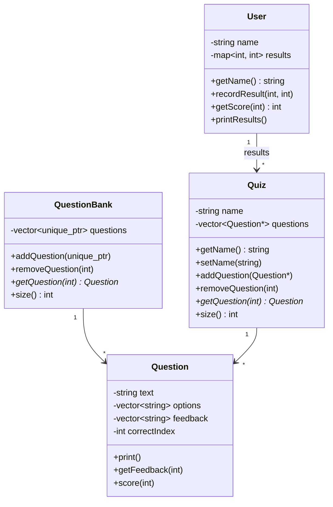

# 🧠 Simple Quiz App – Specification

---

## 🧩 Overview

This app allows multiple users to take multiple-choice quizzes. Key features:

- Multiple users can log in and take quizzes.
- Each quiz consists of multiple-choice questions.
- Questions can be reused across multiple quizzes.
- Users receive immediate feedback after each answer.
- Results are saved per user and can be viewed later.
- Users can view their past performance on each quiz.

---

## 🔍 Nouns (Entities)

- **Quiz** — A collection of questions with a title.
- **Question** — A multiple-choice question with answer options, feedback per option, and a correct answer.
- **User** — A user with a name and a record of results (quiz attempts).
- **QuestionBank** — A shared pool of all questions available in the system.

---

## 🛠️ Verbs (Actions)

- Take quiz  
- Store results  
- Load user  
- Add question to quiz  
- Remove question from quiz  
- View past results  
- Add or remove questions from the question bank  

---

## 📦 Class Design

### `class Question`
```cpp
class Question {
private:
    std::string text;
    std::vector<std::string> options;         // Option A-D
    std::vector<std::string> feedback;        // Feedback for each option
    int correctIndex;                         // Index of correct option (0-3)

public:
    Question(std::string t, std::vector<std::string> o, std::vector<std::string> f, int a);

    void print() const;
    std::string getFeedback(int userChoice) const;
    bool score(int userChoice) const;
};
```

---

### `class QuestionBank`
```cpp
class QuestionBank {
private:
    std::vector<std::unique_ptr<Question>> questions;

public:
    void addQuestion(std::unique_ptr<Question> q);
    void removeQuestion(int index);
    Question* getQuestion(int index) const;
    int size() const;
};
```

---

### `class Quiz`
```cpp
class Quiz {
private:
    std::string name;
    std::vector<Question*> questions; // Pointers to questions in QuestionBank

public:
    Quiz(std::string n);

    const std::string& getName() const;
    void setName(std::string newName);

    void addQuestion(Question* q);
    void removeQuestion(int index);
    Question* getQuestion(int index) const;
    int size() const;
};
```

---

### `class User`
```cpp
class User {
private:
    std::string name;
    std::map<int, int> results; // key = quiz ID, value = score

public:
    User(std::string n);

    const std::string& getName() const;
    void recordResult(int quizId, int score);
    int getScore(int quizId) const;
    void printResults() const;
};
```

---

## 🧪 Behavior Flow

### On Launch:
1. Prompt to **log in** or **create a new user**.
2. Show **menu**:
    - Take a quiz
    - View past results
    - Exit

### Taking a Quiz:
1. Show list of available quizzes.
2. User selects a quiz.
3. For each question:
    - Show the question and options.
    - Take user input (A/B/C/D or 0–3).
    - Provide immediate feedback.
    - Track correct answers.
4. At the end, show:
    - Number correct
    - Percentage score
5. Save result to the current user profile.

---

## 📁 Data Persistence (Suggestions)

- Use JSON, text, or simple binary files for:
  - User profiles and results
  - QuestionBank
  - Quizzes (with question references by index or ID)
- Optional: Implement file-based or database-based storage for scalability.

---

## 📊 Mermaid Class Diagram



---