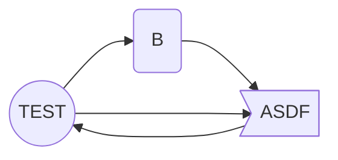

## heading
asdf
- asdf
- asdf
- asdf

asdf

- [ ] asdf
- [x] this is __italics__
- [ ] the is **bold**
- [ ] asdf
- [ ] asdf

```c++
void int main()
{

}

```
$$
\int_{a}^{b} f(x) \, dx
$$


```mermaid
flowchart LR

A((TEST))-->B(B)
B-->C>ASDF]
A-->C
C-->A

```